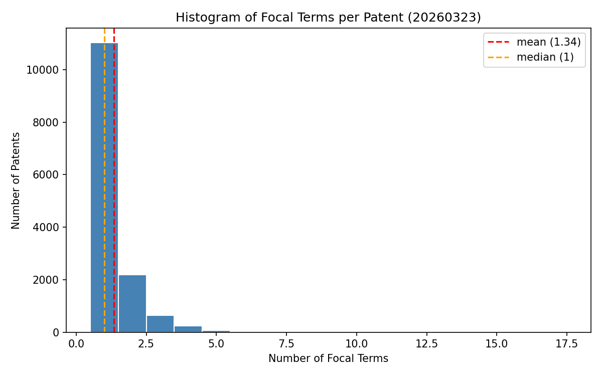
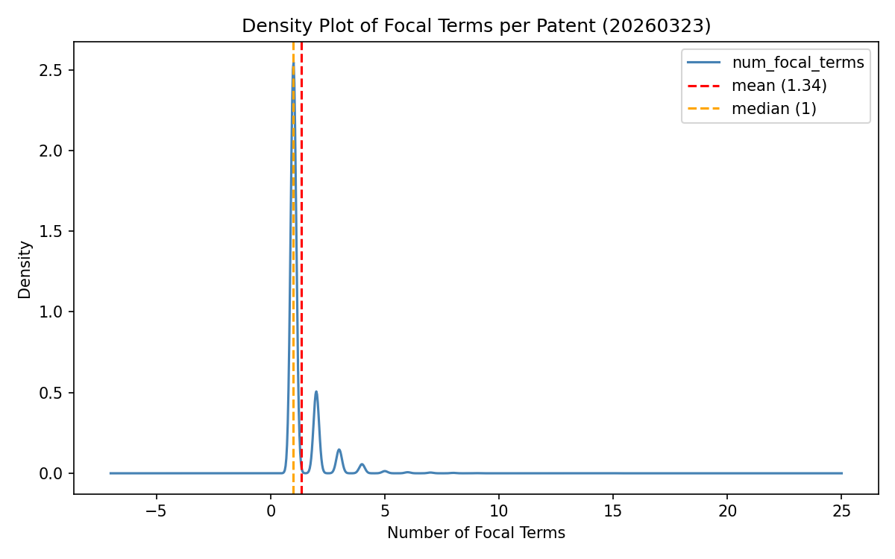

# Task 2 Deliverable – Measure Overlap Intensity (20260323)

## Summary Statistics

| Statistic | Value |
|-----------|-------|
| Total (patent_id, focal_term) pairs | 19,145 |
| Unique patents with focal terms | 14,237 |
| Unique focal term strings | 4,611 |
| Mean focal terms per patent | 1.34 |
| Median focal terms per patent | 1 |
| Std Dev | 0.82 |
| Min | 1 focal term |
| Max | 17 focal terms |

---

## Distribution Breakdown

| Focal terms | Patents | Share |
|-------------|---------|-------|
| Exactly 1   | 11,030  | 77.5% |
| 2 or more   | 3,207   | 22.5% |
| 5 or more   | 131     | 0.9%  |

---

## Distribution Plots

---

## Interpretation

Across 14,237 patents that have at least one cited paper with overlapping terms,
the average number of focal terms is **1.34** (median = 1).
The distribution is **strongly right-skewed**: the vast majority of patents share
only a single term with their cited literature, while a small tail shows richer overlap.

Key observations:
- **77.5% of patents** have exactly 1 focal term — minimal terminological overlap with cited science
- **22.5% of patents** share 2 or more focal terms — moderate overlap
- **Only 0.9%** share 5 or more focal terms — deep, substantive terminological alignment

### Examples

**Minimum (1 focal term)** — Patent `10000506`:
Shares only the term *"thienopyridine"* with its cited papers. Highly specific chemical compound name — the patent likely covers a narrow application of this molecule not broadly discussed in the cited literature.

**Typical (5 focal terms)** — Patent `10004742`:
Shares *"lapatinib", "trastuzumab", "capecitabine", "paclitaxel", "letrozole"* with its cited papers — all cancer therapeutics, suggesting a patent on combination therapy that is well-grounded in the clinical literature.

**Maximum (17 focal terms)** — Patent `8486991`:
Shares an extensive list of antiretroviral drug names (*"zidovudine", "lamivudine", "efavirenz", "nevirapine", "enfuvirtide"*, etc.) with its cited papers — a patent deeply embedded in HIV/AIDS treatment literature.

### Comparison with previous sample

The previous smaller sample (101 patents) showed a mean of 7.8 focal terms per patent and a median of 6.
The 20260323 dataset (14,237 patents) shows a much lower mean of 1.34 and median of 1.
This reflects the broader and more heterogeneous patent population: most patents cite papers from adjacent fields
where term overlap is incidental rather than central.
