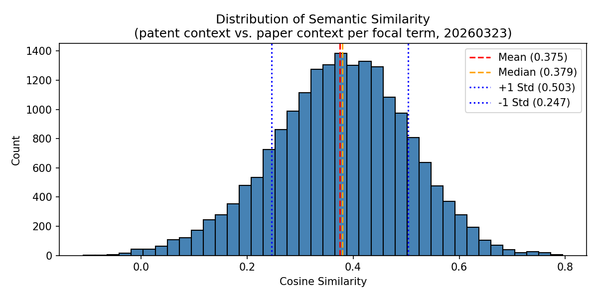

# Task 3 (20260323) — Semantic Comparison Results

## Goal

Assess whether focal terms are used in similar or different semantic contexts across patents and scientific papers.

---

## Quantitative Similarity Measure

For each focal term, a sentence embedding was computed for both its patent context and its paper context using `all-MiniLM-L6-v2`. Cosine similarity was then computed between the two embeddings. Scores range from -1 to 1, where 1 means identical context and 0 means unrelated.

| Statistic | Value |
|---|---|
| Total focal terms compared | 19,145 |
| Mean | 0.375 |
| Median | 0.379 |
| Std Dev | 0.128 |
| Min | -0.109 |
| Max | 0.795 |

The distribution is approximately symmetric and centred around 0.38, indicating **moderate semantic alignment** between patent and paper usage on average. The std of 0.13 shows meaningful variation — some terms are used in very similar contexts, others in quite different ones.

---

## Distribution Plot

---

## Examples: Highest and Lowest Semantic Similarity

### Top 5 — Focal Terms Used in Similar Contexts

**1. `vardenafil` (patent 8653051, sim = 0.795)**

| | Context (sample) |
|---|---|
| **Patent** | dysfunction, short, burst, amount, subject, treatment, treat, male, activity |
| **Paper** | sildenafil, tadalafil, 24weeks, phosphodiesterase-5 |

Both contexts are tightly focused on erectile dysfunction pharmacology — the same class of drugs (PDE5 inhibitors) appears on both sides.

---

**2. `tadalafil` (patent 8653051, sim = 0.794)**

| | Context (sample) |
|---|---|
| **Patent** | dysfunction, short, burst, amount, subject, treatment, treat, male, activity |
| **Paper** | vardenafil, sildenafil, 24weeks, phosphodiesterase-5 |

Same patent, same clinical context. `tadalafil` and `vardenafil` are used interchangeably in both domains.

---

**3. `atazanavir` (patent 9694024, sim = 0.780)**

| | Context (sample) |
|---|---|
| **Patent** | hbv, raltegravir, didanosine, zalcitabine, delavirdine, ca, day |
| **Paper** | nevirapine, tenofovir, didanosine, lopinavir-ritonavir, antiretroviral, efavirenz, indinavir, ritonavir |

Both are firmly in the antiretroviral drug domain — the surrounding terms are other HIV medications in both cases.

---

**4. `cellobiohydrolases` (patent 7923236, sim = 0.776)**

| | Context (sample) |
|---|---|
| **Patent** | endoglucanase, bleaching, cellobiohydrolase, activity, glucuronidase, pulp, ligninase, xylanase |
| **Paper** | glucosidases, reesei, arabinofuranosidase, xylanases |

A highly specific enzyme term — the surrounding vocabulary in both domains is the same narrow set of cellulolytic enzymes.

---

**5. `glucono-δ-lactone` (patent 8703452, sim = 0.776)**

| | Context (sample) |
|---|---|
| **Patent** | cellobiono-δ-lactone, lactonase, having, contacting, sequence, identity, activity |
| **Paper** | lactonase, deconstruct |

Niche biochemical term used in an identical enzymatic context on both sides.

---

### Bottom 5 — Focal Terms Used in Different Contexts

**1. `known` (patent 7282727, sim = -0.109)**

| | Context (sample) |
|---|---|
| **Patent** | electron gun, landmine, exit, meter, rolled, energies, limited, means |
| **Paper** | node-positive, antiangiogenic, imaging |

Patent is about landmine detection hardware; cited paper is about cancer imaging. `"known"` is a stop-word-like term with no domain meaning — the two vocabularies are completely unrelated.

---

**2. `known` (patent 6964849, sim = -0.082)**

| | Context (sample) |
|---|---|
| **Patent** | nucleic acid, nucleotide sequence, promoter, mammalian, marker, cancer |
| **Paper** | parasomnia |

Patent is about molecular biology; cited paper is about sleep disorders. Again `"known"` is generic — its presence as a focal term is incidental.

---

**3. `known` (patent 6991901, sim = -0.082)**

| | Context (sample) |
|---|---|
| **Patent** | nucleic acid, nucleotide sequence, promoter, mammalian, marker, cancer |
| **Paper** | parasomnia |

Same mismatch as above — a different patent with the same unrelated paper context.

---

**4. `following` (patent 7956037, sim = -0.057)**

| | Context (sample) |
|---|---|
| **Patent** | intravenous, kb-r7943, reactive oxygen species, ischemic stroke, thrombolytic agent |
| **Paper** | mid-range |

Patent is about stroke treatment; cited paper contributes only one vague term. `"following"` is a function word with no semantic anchor.

---

**5. `up` (patent 9498751, sim = -0.055)**

| | Context (sample) |
|---|---|
| **Patent** | solids, nm, aluminum, zeolite, pd, washcoat, contacting |
| **Paper** | passivates, photoluminescence, hydrogen-terminated, surface-functionalized, octadecyltrimethoxysilane |

Patent is about catalytic converters; cited paper is about surface chemistry. `"up"` is a generic term whose co-occurrence with these terms is coincidental.

---

## Interpretation

The mean similarity of **0.375** is somewhat lower than in the small sample (0.441), reflecting the greater diversity of patents and domains in the full dataset. The pattern is consistent:

- **High similarity** occurs for domain-specific drug names, enzymes, and chemical compounds — terms with narrow, stable meanings that are used the same way in both patents and science.
- **Low similarity** occurs for generic, function words (`known`, `following`, `up`) that happen to co-occur across unrelated patent and paper domains. These terms are focal terms by coincidence — they appear in both domains but carry no shared semantic content.
