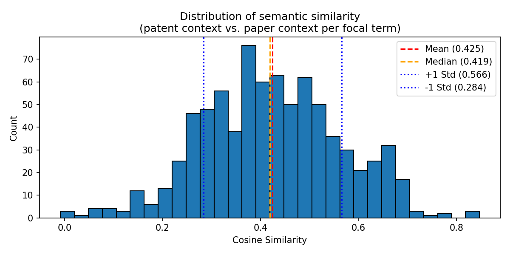

# Task 3 — Semantic Comparison Results

## Quantitative Similarity Measure

Cosine similarity was computed between the patent-context embedding and the paper-context embedding for each focal term. Scores range from -1 to 1, where 1 means identical context and 0 means unrelated.

| Statistic | Value |
|---|---|
| Mean | 0.441 |
| Median | 0.443 |
| Std Dev | 0.140 |
| Min | -0.008 |
| Max | 0.843 |

## Distribution Plot

The distribution is approximately bell-shaped and centred around 0.44, indicating moderate semantic alignment between patent and paper usage on average. The std of 0.14 shows meaningful variation across focal terms. Some are used in very similar contexts, others in quite different ones.

---

## Examples: Highest and Lowest Semantic Similarity

### Top 3 Highest Similarity — Focal Terms Used in Similar Contexts

**1. `asbestos-related` (patent 8168398, sim = 0.843)**

| | Context (sample) |
|---|---|
| **Patent** | indicates, increased, having, method, human, assaying, concluded, mesothelioma, presence |
| **Paper** | significant, nonmalignant, mesothelioma, cancer, enzyme-linked, presence, disease, asbestos, milliliter |

Both revolve around mesothelioma diagnosis — a narrow clinical domain with tight shared vocabulary.

---

**2. `asbestos` (patent 8168398, sim = 0.820)**

| | Context (sample) |
|---|---|
| **Patent** | indicates, increased, having, method, human, assaying, concluded, mesothelioma, presence |
| **Paper** | functional, significant, letter, radiograph, chemoprevention, mesothelioma, error, cancer, enzyme-linked, presence |

Same patent, same clinical context — mesothelioma and cancer terminology dominates both sides.

---

**3. `presence` (patent 8168398, sim = 0.801)**

| | Context (sample) |
|---|---|
| **Patent** | indicates, increased, having, method, human, assaying, concluded, mesothelioma, age-matched |
| **Paper** | significant, nonmalignant, mesothelioma, cancer, enzyme-linked, disease, asbestos, milliliter, normal |

Though *presence* is a common word, here it is embedded in identical domain-specific contexts on both sides.

---

### Bottom 3 Lowest Similarity — Focal Terms Used in Different Contexts

**1. `first` (patent 7838242, sim = -0.008)**

| | Context (sample) |
|---|---|
| **Patent** | hollow, bacteria, listeria monocytogenes, method, internalin a, release, assaying, end |
| **Paper** | population-based, hypoglycemia, found, insulin, major, long-term, pump, risk |

Patent is about a bacterial delivery device; cited paper is about insulin/diabetes. *"First"* is a generic ordinal with no domain meaning — the two vocabularies are completely unrelated.

---

**2. `second` (patent 7838242, sim = -0.006)**

| | Context (sample) |
|---|---|
| **Patent** | hollow, bacteria, listeria monocytogenes, method, internalin a, release, assaying, end |
| **Paper** | population-based, hypoglycemia, found, insulin, major, long-term, pump, risk |

Same patent/paper mismatch as above — *"second"* is equally generic and the sub-fields are unrelated.

---

**3. `group` (patent 7790843, sim = 0.010)**

| | Context (sample) |
|---|---|
| **Patent** | amino acids, selected, 1-220, 221-454, amino acid sequence, sequence, 350-454, amino acid, 1-450, seq |
| **Paper** | same, grouping, cortex, male, cerebral, diencephalon, cortical, investigation, morphometric, region |

Patent uses *"group"* in the sense of amino acid sequence ranges; the paper uses it for brain region groupings — entirely different meanings.

---

## Cosine Similarity per Focal Term

| Patent ID | Focal Term | Cosine Similarity |
|---|---|---|
| 7662783 | alpha | 0.363 |
| 7662783 | antagonist | 0.353 |
| 7662783 | cell | 0.337 |
| 7662783 | collagen | 0.365 |
| 7662783 | colon | 0.374 |
| 7662783 | effect | 0.258 |
| 7662783 | effective | 0.324 |
| 7662783 | growth | 0.378 |
| 7662783 | lung | 0.350 |
| 7662783 | melanoma | 0.370 |
| 7662783 | peptide | 0.392 |
| 7662783 | proliferation | 0.390 |
| 7662783 | sequence | 0.147 |
| 7662783 | skin | 0.348 |
| 7662783 | treatment | 0.369 |
| 7662783 | tumor | 0.372 |
| 7700783 | agent | 0.173 |
| 7700783 | hydroxyl | 0.276 |
| 7704363 | and | 0.285 |
| 7704363 | concentration | 0.433 |
| 7704363 | maximum | 0.292 |
| 7704363 | presence | 0.360 |
| 7723513 | bis | 0.536 |
| 7723513 | copper | 0.565 |
| 7723513 | coupling | 0.572 |
| 7723513 | dichloromethane | 0.421 |
| 7723513 | dipyrrinato | 0.552 |
| 7723513 | metal | 0.546 |
| 7723513 | palladium | 0.587 |
| 7723513 | reaction | 0.558 |
| 7723513 | solvent | 0.398 |
| 7723513 | toluene | 0.582 |
| 7723513 | zinc | 0.594 |
| 7741269 | exendin-4 | 0.379 |
| 7741269 | peptide | 0.294 |
| 7741269 | sequence | 0.255 |
| 7741269 | treatment | 0.268 |
| 7749408 | room | 0.340 |
| 7754703 | aryl | 0.256 |
| 7754703 | compound | 0.147 |
| 7754703 | group | 0.024 |
| 7754703 | phosphate | 0.101 |
| 7754703 | phosphonate | 0.265 |
| 7754860 | hormone | 0.418 |
| 7754860 | mg | 0.427 |
| 7754860 | recombinant | 0.409 |
| 7754909 | solution | 0.349 |
| 7766658 | diagnosis | 0.470 |
| 7766658 | disease | 0.452 |
| 7766658 | drug | 0.336 |
