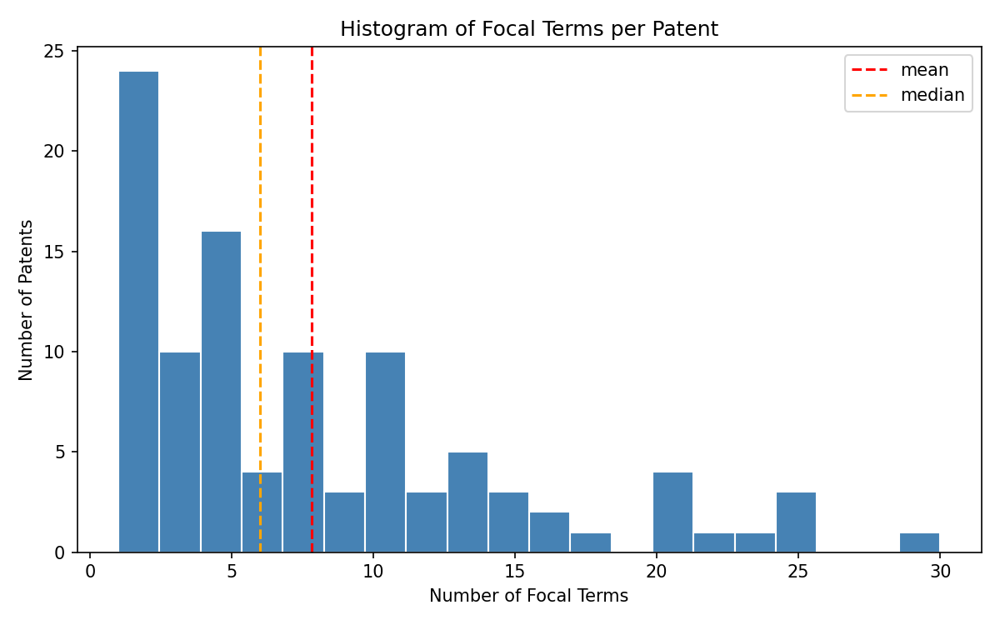

# Task 2 — Descriptive Statistics and Distribution of Overlap

## Summary Statistics

| Metric | Value |
|---|---|
| Total (patent_id, focal_term) pairs | 790 |
| Unique patents | 101 |
| Unique focal terms | 494 |
| Mean focal terms per patent | 7.82 |
| Median focal terms per patent | 6.00 |
| Std Dev | 6.83 |
| Min | 1 |
| 25th percentile | 3 |
| 75th percentile | 11 |
| Max | 30 |

---

## Distribution Plot

The histogram shows the number of focal terms per patent. The red dashed line marks the **mean (7.82)** and the orange dashed line marks the **median (6.00)**. The gap between mean and median confirms the distribution is **right-skewed** — a few patents with many focal terms pull the mean upward.

---

## Brief Descriptive Interpretation

The 101 patents share on average **7.8 focal terms** with their cited scientific papers, totalling **790 unique (patent_id, focal_term) pairs**. However, the 494 unique term strings (vs. 790 pairs) show that the same term — e.g. *"cell"* or *"sequence"* — can be a focal term across multiple patents.

The distribution is **right-skewed**: most patents have relatively few focal terms, while a small number have many. This suggests that terminological overlap between patents and science is generally limited, with occasional exceptions where a patent is deeply embedded in scientific vocabulary.

**Key thresholds:**
- **25% of patents** have ≤ 3 focal terms → minimal overlap with cited science
- **50% of patents** have ≤ 6 focal terms → moderate overlap
- **75% of patents** have ≤ 11 focal terms → strong overlap is the exception, not the rule

**Illustrative examples:**

| Patent ID | Focal Terms (n) | Example Terms | Interpretation |
|---|---|---|---|
| 7749408 | 1 (min) | *"room"* | Near-zero terminological overlap; the cited paper shares almost no vocabulary with the patent |
| 7884261 | 6 (median) | *"increase", "plant", "promoter", "rice", "transgenic", "yield"* | Typical patent — moderate, domain-specific overlap with agricultural/biological science |
| 8280136 | 30 (max) | *"cardiac", "heart", "dyssynchrony", "myocardial", "device", "model", ...* | Strongly grounded in medical/cardiac scientific literature; high terminological alignment |
